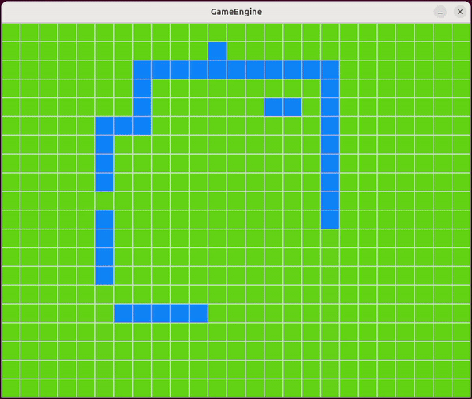
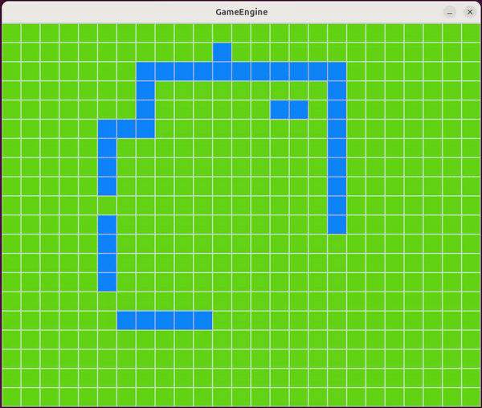
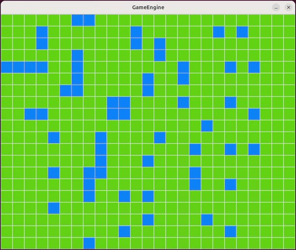

# Search game engine

<!-- 
 -->

<div align="center">
  
  
</div>
<div align="center">
  
  
</div>

## Usage

Build docker image
```bash
docker compose build
```

Start docker container
```bash
docker compose up -d
```

Enter docker container
```bash
docker exec -it search_game-cpp-dev-1 /bin/bash
```

### Build

```bash
cd app/
mkdir build
cd build/
cmake ..
make
```

### Run

Once build ready:
```bash
cd build/
./game
```
Select a start and goal position on the map.

## Before running

From localhost:
```bash
xhost +
```

## Ideas for later

- Show path being explored live
- Make this run online?
- Automatic xhost + 
- Automated formatting
- Make user put the obstacles
- Reset button
- Make game bigger with more tiles
- Make it modular and let people choose size
- Generate random maze